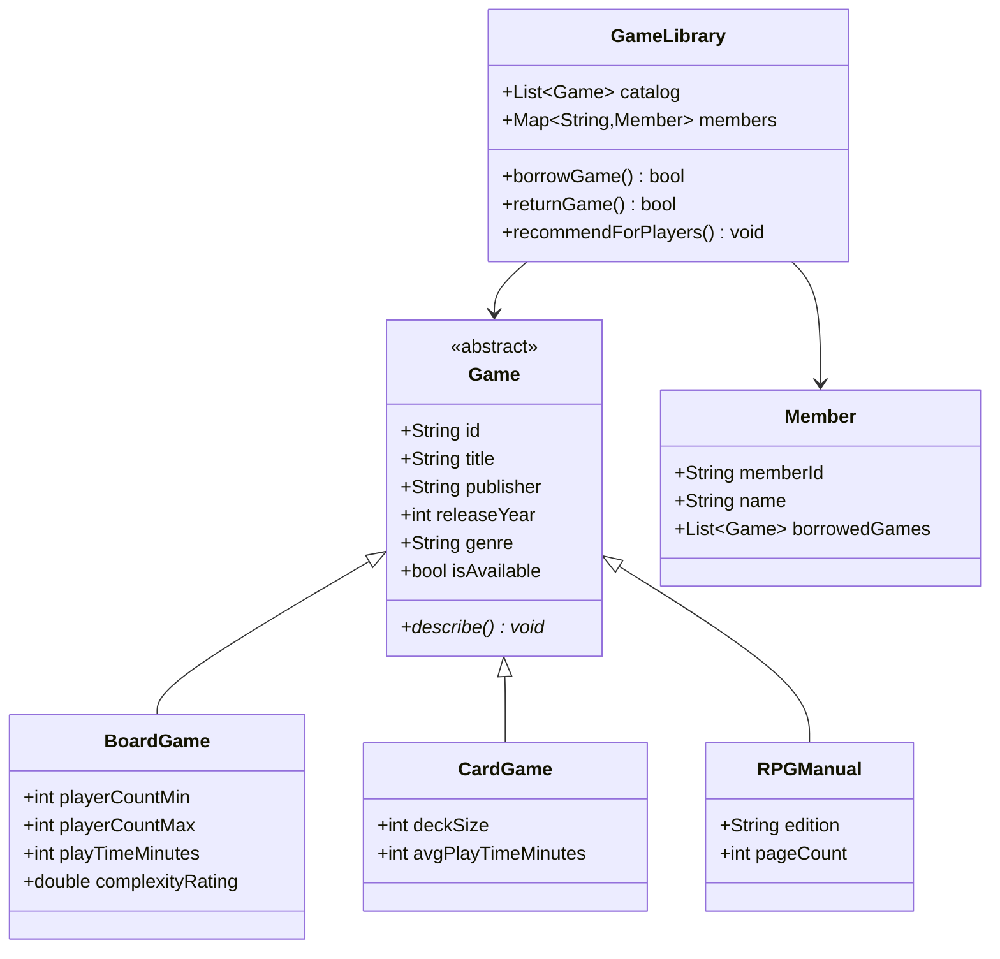

# Community Board Game Lending Library

**Assignment 1 — Dart Console Application**  
**Name:** Soumitra Deshpande  
**Roll No:** 150096724035  
**Environment:** Dart SDK 3.x

---

## 1. The Pitch

Most first-year console apps model a book library. This one models something far more interesting: a **community board game lending library**. Instead of tracking paperbacks and e-books, it tracks tabletop games — board games, card games, and RPG manuals — and helps members find the right game for the right group.

The app is built in Dart and demonstrates variables, control flow, loops, functions, and object-oriented inheritance without copying the usual physical/digital media split.

---

## 2. A Shift at the Library

Here is what happens when the program runs:

1. The librarian opens the catalog. Four games are listed: two board games, one card game, and one RPG manual.
2. **Soumitra Deshpande** borrows *Wingspan*. **Alex Chen** borrows *Love Letter*.
3. A group of three friends walks in. The librarian runs a recommendation check and suggests *Catan* because it supports exactly three players.
4. Soumitra returns *Wingspan*.
5. The system prints each member's current borrow record.
6. The late-fee calculator shows what happens if games come back overdue.

This single workflow exercises every required Dart concept.

---

## 3. What's Under the Hood

The system is built around three ideas:

- **A shared base type.** Every item in the catalog is a `Game`. The exact kind of game is handled by subclasses.
- **A member registry.** Members are stored in a `Map<String, Member>` for fast lookup by ID.
- **A librarian.** `GameLibrary` holds the catalog, registers members, handles checkout/return, and recommends games.



---

## 4. Dart Concepts in Action

| Requirement | Where It Lives |
|---|---|
| Variables (`String`, `int`, `double`, `bool`) | `Game` fields, `BoardGame.playerCountMin`, `RPGManual.pageCount` |
| Collections (`List`, `Map`) | `GameLibrary.catalog`, `Member.borrowedGames`, `GameLibrary.members` |
| Named parameters & defaults | `calculateLateFee({required int overdueDays, double dailyRate = 1.5})` |
| Typed return values | `borrowGame()` returns `bool`, `findGameById()` returns `Game?` |
| `for` loop | Indexed catalog listing in `GameLibrary.listCatalog()` |
| `while` loop | Player-count recommendation search in `recommendForPlayers()` |
| `for-in` loop | Iterating member borrows in `Member.showBorrowedGames()` |
| Abstract class | `Game` with abstract `describe()` |
| Inheritance | `BoardGame`, `CardGame`, `RPGManual` extend `Game` |
| Polymorphism | Each subclass `@override` of `describe()` |
| Encapsulation | Borrow/return logic controlled by `GameLibrary` |

---

## 5. File Guide

| File | Responsibility |
|---|---|
| `lib/game.dart` | Abstract `Game` base class |
| `lib/board_game.dart` | Board-game subclass with player counts and complexity |
| `lib/card_game.dart` | Card-game subclass with deck size |
| `lib/rpg_manual.dart` | RPG manual subclass with edition and page count |
| `lib/member.dart` | Member record and active borrow list |
| `lib/game_library.dart` | Central controller for catalog and transactions |
| `lib/late_fee_calculator.dart` | Pure function for overdue fees |
| `lib/main.dart` | Demo script that runs the workflow |

---

## 6. Design Notes

**Why inheritance?** Board games, card games, and RPG manuals share common fields — title, publisher, year, genre, availability — but each has unique data. An abstract `Game` class lets the rest of the system treat every item uniformly while subclasses store their own details.

**Why a `while` loop for recommendations?** The assignment required multiple loop types. The recommendation search is a natural fit for `while` because it scans until the catalog ends and conditionally collects matches.

**Why named parameters everywhere?** Dart's `{required ...}` syntax removes ambiguity. `borrowGame(memberId: 'M001', gameId: 'BG002')` is clearer than positional arguments.

---

## 7. Edge Cases That Don't Break It

| Situation | Behavior |
|---|---|
| Invalid member ID | `Map` lookup returns `null`; transaction is rejected |
| Invalid game ID | Search returns `null`; transaction is rejected |
| Borrowing an already-borrowed game | Blocked by `isAvailable` check |
| Returning a game you never borrowed | Rejected after checking `borrowedGames` |
| Zero or negative overdue days | `calculateLateFee` returns `$0.00` |
| No games match the player count | Prints a clear message instead of crashing |

---

## 8. Run It Yourself

```bash
cd assignment_1
dart pub get
dart run lib/main.dart
```

Expected output:

```
=== GAME CATALOG ===
1.
[BG001] Catan — Board Game
  Publisher: Kosmos | Year: 1995 | Genre: Strategy
  Players: 3-4 | Playtime: 90m | Complexity: 2.3/5
  Status: Available
2.
[BG002] Wingspan — Board Game
  Publisher: Stonemaier Games | Year: 2019 | Genre: Strategy
  Players: 1-5 | Playtime: 70m | Complexity: 2.4/5
  Status: Available
3.
[CG001] Love Letter — Card Game
  Publisher: Z-Man Games | Year: 2012 | Genre: Bluffing
  Deck size: 16 cards | Avg playtime: 20m
  Status: Available
4.
[RPG001] D&D Player's Handbook — RPG Manual
  Publisher: Wizards of the Coast | Year: 2014 | Genre: RPG
  Edition: 5th Edition | Pages: 320
  Status: Available
Soumitra Deshpande borrowed Wingspan.
Alex Chen borrowed Love Letter.

=== RECOMMENDATIONS FOR 3 PLAYERS ===
  • Catan (3-4 players, 90m)
Soumitra Deshpande returned Wingspan.

=== MEMBER BORROWS ===
  Soumitra Deshpande has no borrowed games.
  Alex Chen has borrowed:
    • Love Letter

=== LATE FEE EXAMPLES ===
Card game 5 days late: $7.50
RPG manual 3 days late: $9.00
```

---

## 9. Terminal Proof


---

## 10. What Could Come Next

- Add a `Reservation` class for holds on borrowed games.
- Persist the catalog and member list to JSON.
- Add due dates and automatic overdue reminders.
- Build an interactive CLI menu instead of a fixed demo.

---

## 11. Closing

This assignment shows the same core Dart skills as a traditional library app, but applied to a different domain. A board game library needs the same inheritance, collections, and control flow — it just happens to be more fun to demo.
