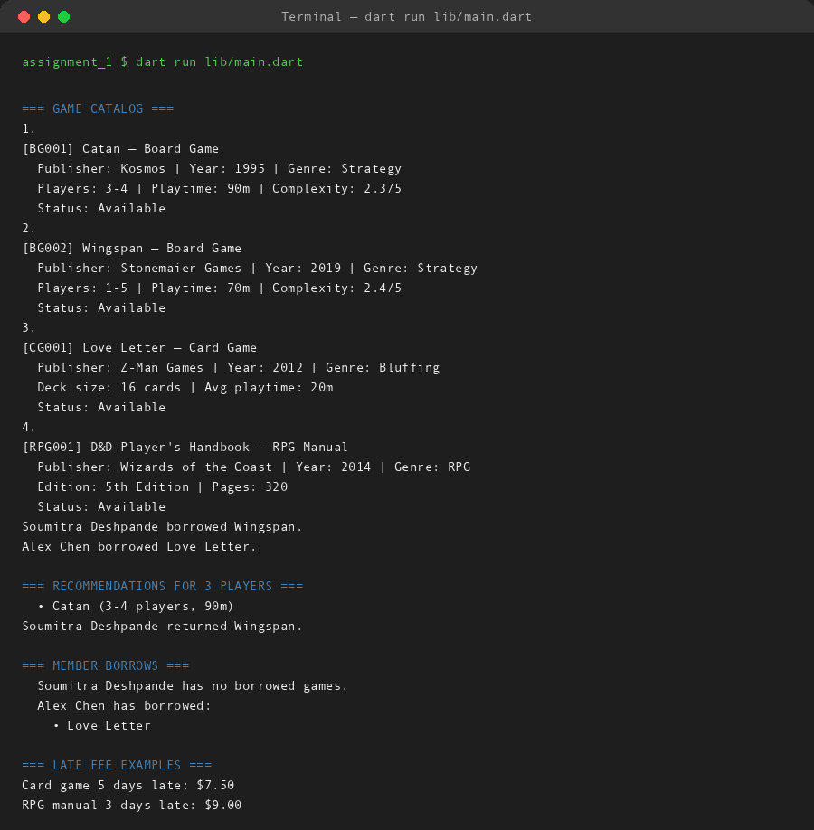

# Community Board Game Lending Library

**Assignment 1 — Dart Console Application**  
**Name:** Soumitra Deshpande  
**Roll No:** 150096724035  
**Environment:** Dart SDK 3.x

---

## 1. What This Is

A Dart console app that models a neighborhood board game lending library. It manages a catalog of tabletop games — board games, card games, RPG manuals — lets members borrow and return them, recommends games by player count, and calculates late fees.

The assignment brief asked for variables, loops, functions, and OOP with inheritance. This app hits all four through the lens of game lending.

---

## 2. Quick Start

```bash
cd assignment_1
dart pub get
dart run lib/main.dart
```

The demo creates four games, registers two members, runs a full borrow-return cycle, and prints late fees.

---

## 3. The Demo

When you run the app, this is what happens on screen:

```
=== GAME CATALOG ===
1.
[BG001] Catan — Board Game
  Publisher: Kosmos | Year: 1995 | Genre: Strategy
  Players: 3-4 | Playtime: 90m | Complexity: 2.3/5
  Status: Available
2.
[BG002] Wingspan — Board Game
  Publisher: Stonemaier Games | Year: 2019 | Genre: Strategy
  Players: 1-5 | Playtime: 70m | Complexity: 2.4/5
  Status: Available
3.
[CG001] Love Letter — Card Game
  Publisher: Z-Man Games | Year: 2012 | Genre: Bluffing
  Deck size: 16 cards | Avg playtime: 20m
  Status: Available
4.
[RPG001] D&D Player's Handbook — RPG Manual
  Publisher: Wizards of the Coast | Year: 2014 | Genre: RPG
  Edition: 5th Edition | Pages: 320
  Status: Available
Soumitra Deshpande borrowed Wingspan.
Alex Chen borrowed Love Letter.

=== RECOMMENDATIONS FOR 3 PLAYERS ===
  • Catan (3-4 players, 90m)
Soumitra Deshpande returned Wingspan.

=== MEMBER BORROWS ===
  Soumitra Deshpande has no borrowed games.
  Alex Chen has borrowed:
    • Love Letter

=== LATE FEE EXAMPLES ===
Card game 5 days late: $7.50
RPG manual 3 days late: $9.00
```

Every required Dart feature appears somewhere in this output.

---

## 4. How the Recommendation Logic Works

The most board-game-specific part of the code is `GameLibrary.recommendForPlayers(int playerCount)`.

It uses a `while` loop to walk the catalog. For each `BoardGame`, it checks:

- Is the game available?
- Does the requested player count fall between `playerCountMin` and `playerCountMax`?

If all three pass, the game is printed as a recommendation.

```dart
void recommendForPlayers(int playerCount) {
  bool found = false;
  int index = 0;

  while (index < catalog.length) {
    final game = catalog[index];
    if (game is BoardGame &&
        game.isAvailable &&
        game.playerCountMin <= playerCount &&
        game.playerCountMax >= playerCount) {
      print('  • ${game.title} (${game.playerRange} players, ${game.playTimeMinutes}m)');
      found = true;
    }
    index++;
  }

  if (!found) {
    print('  No available board games found for $playerCount players.');
  }
}
```

This is the heart of the app. It is why the class hierarchy exists: only `BoardGame` has `playerCountMin` and `playerCountMax`, so the `game is BoardGame` check is what makes the recommendation work.

---

## 5. Code Tour

| File | What It Does |
|---|---|
| `lib/main.dart` | Entry point. Creates the library, adds games, registers members, runs the demo. |
| `lib/game.dart` | Abstract base class. Holds shared fields (`id`, `title`, `publisher`, `releaseYear`, `genre`, `isAvailable`) and declares `describe()`. |
| `lib/board_game.dart` | `BoardGame` subclass. Adds player counts, playtime, and complexity rating. |
| `lib/card_game.dart` | `CardGame` subclass. Adds deck size and average playtime. |
| `lib/rpg_manual.dart` | `RPGManual` subclass. Adds edition and page count. |
| `lib/member.dart` | `Member` class. Tracks a member's borrowed games. |
| `lib/game_library.dart` | `GameLibrary` controller. Manages catalog, members, borrowing, returning, and recommendations. |
| `lib/late_fee_calculator.dart` | Pure utility for overdue fees. |

### How the pieces connect

```
main.dart
    ↓ creates
GameLibrary
    ├── manages catalog: List<Game>
    │       └── Game (abstract)
    │               ├── BoardGame  → playerCountMin/Max, playTimeMinutes, complexityRating
    │               ├── CardGame   → deckSize, avgPlayTimeMinutes
    │               └── RPGManual  → edition, pageCount
    └── manages members: Map<String, Member>
            └── Member → List<Game> borrowedGames
```

---

## 6. When Things Go Wrong

The app handles these board-game-specific edge cases:

| Case | What Happens |
|---|---|
| A member tries to borrow a game that is already out | `borrowGame()` checks `isAvailable` and prints a message |
| A member returns a game they never borrowed | `returnGame()` checks `borrowedGames.contains(game)` and rejects it |
| Recommendation search for a player count nobody supports | The `while` loop finishes and prints "No available board games found" |
| Recommendation search for a player count but all matches are borrowed | Same as above — `isAvailable` is checked before recommending |
| Late fee for 0 or negative overdue days | `calculateLateFee()` returns `$0.00` immediately |
| Late fee for an unrecognized game type | The `switch` falls back to a `1.0` multiplier (card game rate) |

---

## 7. Terminal Proof



---

## 8. Next Steps

- Persist the catalog to a JSON file so the library remembers state between runs.
- Add due dates and track how long each game has been out.
- Let members reserve games that are currently borrowed.
- Build an interactive menu so librarians can add games and members at runtime.

---

**Built by Soumitra Deshpande · Roll No. 150096724035**
