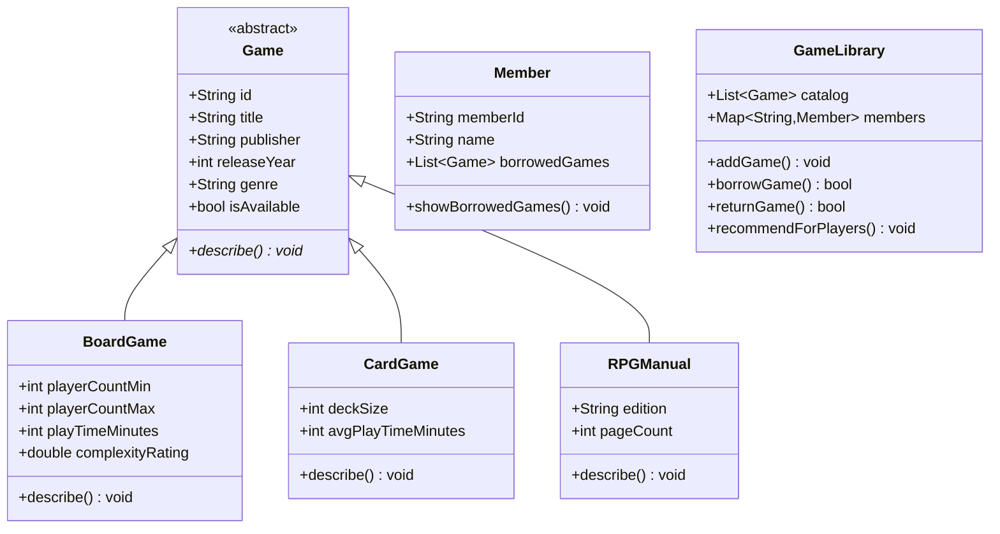

# Community Board Game Lending Library

**Assignment 1 — Dart Console Application**  
**Name:** Soumitra Deshpande  
**Roll No:** 150096724035  
**Environment:** Dart SDK 3.x

---

## 1. Executive Summary

This project models a **community board game lending library** as a console application in Dart. Instead of the usual physical/digital book catalog, it manages tabletop games: board games, card games, and RPG manuals. The app demonstrates variables, control flow, loops, functions, and object-oriented inheritance in a clean, modular way.

### Objectives
- Model real-world game lending with an abstract base class and subclasses.
- Use `List<Game>` for the catalog and `Map<String, Member>` for member lookup.
- Implement named parameters, default values, and typed return values.
- Use `for`, `while`, and `for-in` loops for different operations.

---

## 2. Dart Language Fundamentals

| Concept | Usage in Project |
|---|---|
| **Variables** | `String`, `int`, `double`, `bool`, `List<Game>`, `Map<String, Member>` |
| **Null Safety** | `Game?` for nullable search results; `required` named params |
| **Functions** | Named params with `required`, optional defaults (`dailyRate = 1.5`), typed returns |
| **Loops** | Indexed `for` in catalog list, `while` in recommendation search, `for-in` for member borrows |
| **Collections** | `List` for catalog and borrowed items, `Map` for member registry |

---

## 3. Object-Oriented Architecture

### Four Pillars
1. **Abstraction** — `Game` is abstract; it defines the contract `describe()` without implementation.
2. **Inheritance** — `BoardGame`, `CardGame`, and `RPGManual` extend `Game` using `super` parameters.
3. **Polymorphism** — Each subclass `@override` the `describe()` method for its own output format.
4. **Encapsulation** — `GameLibrary` controls catalog and borrow logic; `Member` owns its borrow list.

### Class Hierarchy



---

## 4. System Architecture

```
┌─────────────────────────────────────┐
│           main.dart                 │
│  Creates games, members, and runs   │
│  the demonstration workflow.        │
└──────────────┬──────────────────────┘
               │
┌──────────────▼──────────────────────┐
│         GameLibrary                 │
│  Catalog (List<Game>)               │
│  Members (Map<String, Member>)      │
└──────────────┬──────────────────────┘
               │ uses
┌──────────────▼──────────────────────┐
│  BoardGame / CardGame / RPGManual   │
│  (inherit from abstract Game)       │
└─────────────────────────────────────┘
```

---

## 5. Algorithmic Complexity

| Operation | Structure | Average Complexity |
|---|---|---|
| Add game | `List.add` | O(1) amortized |
| Register member | `Map` insertion | O(1) |
| Find game by ID | Linear scan of `List` | O(n) |
| Find member by ID | `Map` lookup | O(1) |
| Recommend games | Linear `while` scan | O(n) |

---

## 6. File-by-File Breakdown

### `lib/game.dart`
Abstract base class `Game`. Holds common fields (`id`, `title`, `publisher`, `releaseYear`, `genre`, `isAvailable`) and declares the abstract `describe()` method.

### `lib/board_game.dart`
Subclass for board games. Adds `playerCountMin`, `playerCountMax`, `playTimeMinutes`, and `complexityRating`.

### `lib/card_game.dart`
Subclass for card games. Adds `deckSize` and `avgPlayTimeMinutes`.

### `lib/rpg_manual.dart`
Subclass for RPG manuals. Adds `edition` and `pageCount`.

### `lib/member.dart`
Represents a library member. Tracks `memberId`, `name`, and a `List<Game>` of borrowed items.

### `lib/game_library.dart`
Central controller. Manages catalog and members, handles borrow/return logic, and recommends board games by player count using a `while` loop.

### `lib/late_fee_calculator.dart`
Pure utility function with named parameters and a default rate. Applies multipliers based on game type.

### `lib/main.dart`
Driver script. Creates sample data, runs catalog listing, borrows, recommends, returns, and prints late fees.

---

## 7. Edge Cases Handled

| Scenario | Handling |
|---|---|
| Member not found | `Map` lookup returns `null`; prints error and returns `false` |
| Game not found | Search returns `null`; prints error and returns `false` |
| Game already borrowed | Checks `isAvailable` before lending |
| Returning a game not borrowed | Validates `borrowedGames.contains(game)` |
| Zero/negative overdue days | `calculateLateFee` returns `0.0` |
| No recommendations found | Prints a clear "No available board games found" message |

---

## 8. Step-by-Step Execution Trace

1. `GameLibrary` is instantiated.
2. Four games are added to the catalog: two board games, one card game, one RPG manual.
3. Two members are registered: **Soumitra Deshpande** and **Alex Chen**.
4. `listCatalog()` prints all games with an indexed `for` loop.
5. Soumitra borrows **Wingspan**; Alex borrows **Love Letter**.
6. `recommendForPlayers(3)` uses a `while` loop and finds **Catan**.
7. Soumitra returns **Wingspan**.
8. `for-in` loop prints each member's current borrow list.
9. Late fees are calculated for card game and RPG manual.

---

## 9. Console Verification

The program was executed successfully with the following output:

```
=== GAME CATALOG ===
1.
[BG001] Catan — Board Game
  Publisher: Kosmos | Year: 1995 | Genre: Strategy
  Players: 3-4 | Playtime: 90m | Complexity: 2.3/5
  Status: Available
2.
[BG002] Wingspan — Board Game
  Publisher: Stonemaier Games | Year: 2019 | Genre: Strategy
  Players: 1-5 | Playtime: 70m | Complexity: 2.4/5
  Status: Available
3.
[CG001] Love Letter — Card Game
  Publisher: Z-Man Games | Year: 2012 | Genre: Bluffing
  Deck size: 16 cards | Avg playtime: 20m
  Status: Available
4.
[RPG001] D&D Player's Handbook — RPG Manual
  Publisher: Wizards of the Coast | Year: 2014 | Genre: RPG
  Edition: 5th Edition | Pages: 320
  Status: Available
Soumitra Deshpande borrowed Wingspan.
Alex Chen borrowed Love Letter.

=== RECOMMENDATIONS FOR 3 PLAYERS ===
  • Catan (3-4 players, 90m)
Soumitra Deshpande returned Wingspan.

=== MEMBER BORROWS ===
  Soumitra Deshpande has no borrowed games.
  Alex Chen has borrowed:
    • Love Letter

=== LATE FEE EXAMPLES ===
Card game 5 days late: $7.50
RPG manual 3 days late: $9.00
```

A terminal screenshot is attached at `assets/screenshot.png`.

---

## 10. Future Extensibility

- Add `Reservation` class for game reservations.
- Persist catalog and member data to JSON or SQLite.
- Add due-date tracking and automatic overdue notifications.
- Build a CLI menu for interactive borrow/return operations.

---

## 11. Conclusion

This Dart console application demonstrates core programming concepts through a practical, non-trivial domain. By choosing a board game lending library instead of a generic book system, the assignment stays orthogonal to the reference while still clearly showcasing variables, loops, functions, and OOP inheritance.
