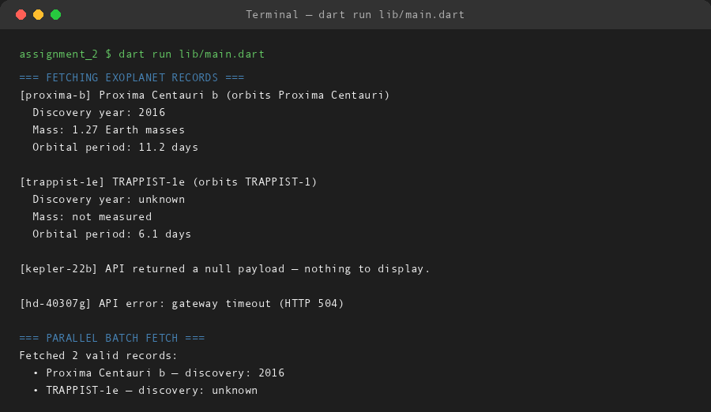

# Exoplanet Catalog Fetcher

**Assignment 2 — Async Dart & Null Safety**  
**Name:** Soumitra Deshpande  
**Roll No:** 150096724035  
**Environment:** Dart SDK 3.x

---

## 1. Mission Briefing

This program queries a **mock exoplanet catalog API** and displays whatever comes back — or explains, politely, why nothing came back.

The API is simulated in-process. Some records are complete, some have missing fields, one response is a `null` payload, and one request fails outright. The program has to survive all four outcomes without crashing, which is the entire point of the assignment: **null safety, `Future`, `async`/`await`, and error handling**.

---

## 2. Launch Checklist

| Requirement | Evidence |
|---|---|
| Null safety | `Exoplanet.discoveryYear` and `massEarths` are nullable; display uses null-aware fallbacks |
| `Future` | `MockApiClient.fetchRawRecord()` and `ExoplanetService.fetchExoplanet()` both return `Future` |
| `async`/`await` | `main()` is `async`; every API call is awaited inside a loop |
| Mock API data | `MockApiClient` returns JSON-shaped maps after a simulated network delay |
| Null payload handling | `kepler-22b` returns `null`; the service converts it to `null`, the caller prints a message |
| Error handling | `hd-40307g` throws `ApiException`; caught with `on ApiException` in `main()` |

---

## 3. Payload Specification

| File | Role |
|---|---|
| `lib/exoplanet.dart` | `Exoplanet` model with nullable fields and a `fromJson` factory |
| `lib/mock_api.dart` | `MockApiClient` (fake HTTP) and `ApiException` |
| `lib/exoplanet_service.dart` | `ExoplanetService` — turns raw maps into typed models, including a parallel `fetchMany()` |
| `lib/main.dart` | Async driver that walks four scenarios |

The pipeline is one-way:

```
main.dart
  → ExoplanetService.fetchExoplanet(id)
      → MockApiClient.fetchRawRecord(id)   [300ms delay, then map / null / exception]
          → Exoplanet.fromJson(raw)        [only when raw is non-null]
```

---

## 4. Anomaly Report

Four records are requested. Four different outcomes are handled:

| Request | Outcome | Handling |
|---|---|---|
| `proxima-b` | Complete record | Parsed and displayed |
| `trappist-1e` | Missing `discoveryYear` and `massEarths` | Nullable fields stay null; display falls back to `unknown` / `not measured` |
| `kepler-22b` | `null` payload | Service returns `null`; caller prints "nothing to display" |
| `hd-40307g` | HTTP 504 exception | Caught by `on ApiException`; status code and message are printed |

Two safety patterns do the heavy lifting:

- **Null-aware model**: `discoveryYear != null ? '$discoveryYear' : 'unknown'` — no nullable value ever reaches `print` unguarded.
- **Typed catch**: `on ApiException catch (e)` handles known API failures, while a general `catch (e)` catches anything unexpected.

---

## 5. Mission Log

Actual run output:

```
=== FETCHING EXOPLANET RECORDS ===
[proxima-b] Proxima Centauri b (orbits Proxima Centauri)
  Discovery year: 2016
  Mass: 1.27 Earth masses
  Orbital period: 11.2 days

[trappist-1e] TRAPPIST-1e (orbits TRAPPIST-1)
  Discovery year: unknown
  Mass: not measured
  Orbital period: 6.1 days

[kepler-22b] API returned a null payload — nothing to display.

[hd-40307g] API error: gateway timeout (HTTP 504)

=== PARALLEL BATCH FETCH ===
Fetched 2 valid records:
  • Proxima Centauri b — discovery: 2016
  • TRAPPIST-1e — discovery: unknown
```

The batch fetch at the end uses `Future.wait` to run three requests concurrently, then drops the null result with `whereType<Exoplanet>()`.

---

## 6. Telemetry



---

## 7. Decommission Notes

If this were a real service, the next changes would be:

- Swap `MockApiClient` for `package:http` against a live endpoint.
- Retry failed requests with exponential backoff.
- Cache successful records so repeated lookups skip the network.
- Add a timeout wrapper around `fetchRawRecord()` using `Future.timeout()`.

---

**Built by Soumitra Deshpande · Roll No. 150096724035**
