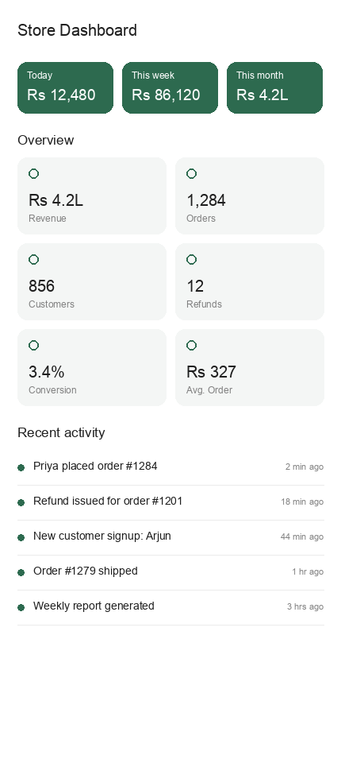

# Responsive Store Dashboard

**Assignment 3 — Responsive Flutter Layouts**
**Name:** Soumitra Deshpande
**Roll No:** 150096724035
**Cohort:** Elon Musk
**Environment:** Flutter 3.x / Dart 3.x

---

## 1. Objective

Build a multi-section store dashboard that adapts to the screen size. The required widgets are `ListView`, `GridView`, `MediaQuery`, and `Flexible`/`Expanded`. The visual design is kept deliberately minimal — white background, one green accent, flat rounded cards.

---

## 2. Requirements Checklist

| Requirement | Where it lives |
|---|---|
| `MediaQuery` | `DashboardScreen.build` reads `MediaQuery.of(context).size.width` |
| `GridView` | `statsGrid` — `GridView.builder` with 8 stat cards |
| `ListView` | `activityList` — `ListView.separated` with 7 activity rows |
| `Expanded` | Header `Row` of summary chips; grid/list slots in narrow layout |
| `Flexible` | Wide layout splits space 2:1 between grid and activity panel |
| Responsive behavior | 2/3/4 grid columns; side-by-side vs stacked sections |

---

## 3. How the Layout Adapts

Breakpoints are derived from the screen width:

| Width | Columns | Section arrangement |
|---|---|---|
| `< 600` (phone) | 2 | Grid stacked above the activity list |
| `600–899` (tablet) | 3 | Grid stacked above the activity list |
| `>= 900` (desktop) | 4 | Grid and activity panel side by side (2:1 via `Flexible`) |

The header row always uses three `Expanded` summary chips, so the chips stretch or shrink to share the full width evenly on any screen.

---

## 4. Widget Map

```
Scaffold
└── Column
    ├── Row                      ← 3 × Expanded(SummaryChip)
    ├── SectionTitle('Overview')
    └── Expanded                 ← fills all remaining space
        ├── width >= 900:  Row[ Flexible(2, GridView), Flexible(1, ActivityPanel(ListView)) ]
        └── width <  900:  Column[ Expanded(3, GridView), Expanded(2, ListView) ]
```

- `StatCard` — flat grey card with an icon, a large value, and a small label.
- `SummaryChip` — green header chip (today / week / month totals).
- `ActivityPanel` — wraps the `ListView` in a titled card on wide screens.

---

## 5. Preview



The preview shows the narrow layout: summary chips on top (via `Expanded`), a 2-column `GridView` of stat cards, and the `ListView` activity feed below.

---

## 6. Run Instructions

```bash
flutter pub get
flutter run          # pick a device, or use flutter run -d chrome
```

Resize the window (or rotate the device) to watch the column count and section arrangement change.

---

## 7. Possible Extensions

- Replace the breakpoint math with `LayoutBuilder` constraints.
- Add pull-to-refresh on the activity `ListView`.
- Animate the layout switch with `AnimatedSwitcher`.

---

**Built by Soumitra Deshpande · Roll No. 150096724035 · Cohort: Elon Musk**
