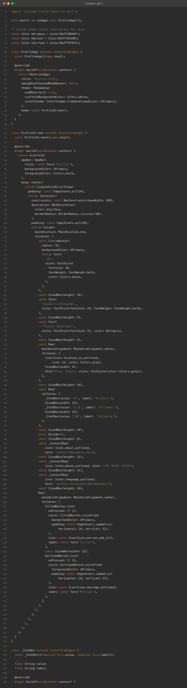
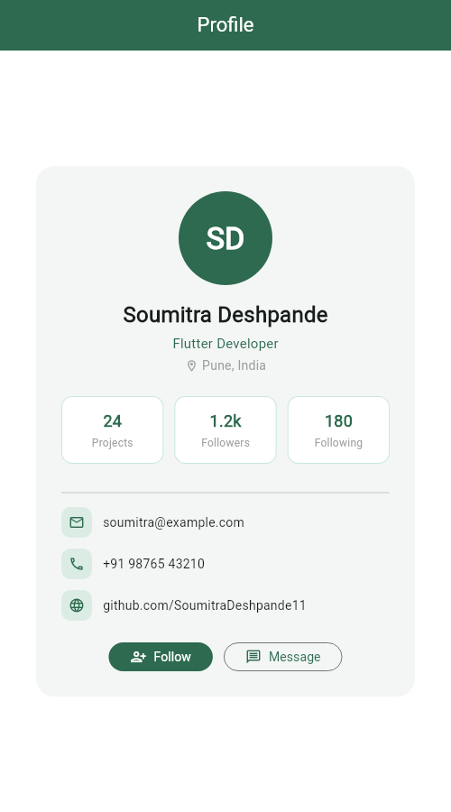
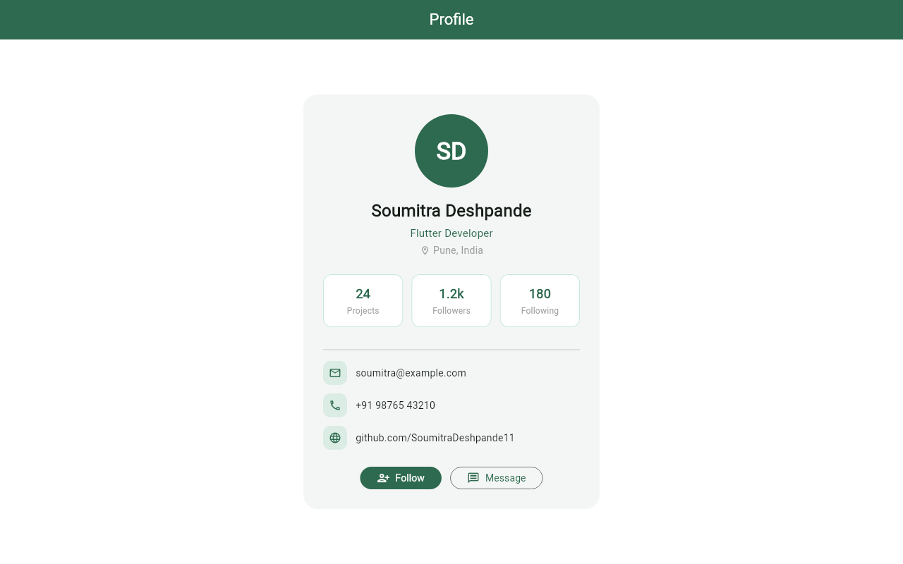
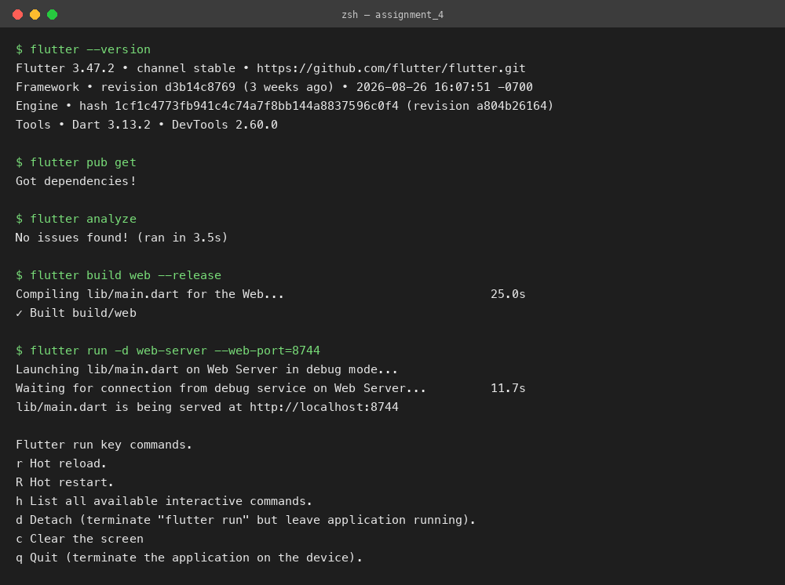

# Profile Card UI

**Assignment 3 (Brief) — Profile Card with Column, Row, Container, CircleAvatar & Custom Theme Colors**
**Name:** Soumitra Deshpande
**Roll No:** 150096724035
**Cohort:** Elon Musk
**Environment:** Flutter 3.x / Dart 3.x
**Code:** https://github.com/SoumitraDeshpande11/assignments/tree/assignments_4

---

## 1. Objective

Build a Flutter profile card screen using the core layout widgets — `Column`, `Row`, `Container`, `CircleAvatar`, `Text`, and `Icon` — styled with custom theme colors.

---

## 2. Requirements Checklist

| Requirement | Where it lives |
|---|---|
| `Column` | Main card layout — avatar, name, stats, contacts stacked vertically |
| `Row` | Location line, the three stat boxes, contact rows, and the action buttons |
| `Container` | The card itself, each stat box, and the icon chips — all with custom padding, color, and rounded corners |
| `CircleAvatar` | Profile picture placeholder with initials "SD" |
| `Text` | Name, role, stats, and contact details in varying sizes/weights |
| `Icon` | Location, email, phone, website, and button icons |
| Custom theme colors | `kPrimary`, `kAccent`, `kSurface` constants feeding `ColorScheme.fromSeed` and the card styling |

---

## 3. How the Layout Works

The screen is a single centered card built from nested layout widgets:

1. A `Container` with a light surface color and 20px rounded corners forms the card.
2. Inside it, one `Column` stacks everything top to bottom.
3. `Row`s handle the horizontal pieces: three equal stat boxes (`Expanded` inside a `Row`), contact lines (icon chip + text), and the Follow/Message buttons.
4. Small reusable widgets — `_StatBox` and `_ContactRow` — keep the build method short and consistent.

Custom colors are defined once as constants (`kPrimary` green, `kAccent` light green, `kSurface` off-white) and reused everywhere, so the whole card recolors by changing three lines.

---

## 4. Widget Map

```
MaterialApp (custom green theme)
└── Scaffold
    ├── AppBar ('Profile')
    └── Center
        └── Container            ← the card (rounded, kSurface)
            └── Column
                ├── CircleAvatar ← "SD" initials
                ├── Text         ← name / role / location (Row with Icon)
                ├── Row          ← _StatBox × 3 (Projects, Followers, Following)
                ├── Divider
                ├── _ContactRow  ← email / phone / GitHub (Icon in Container + Text)
                └── Row          ← Follow (FilledButton) + Message (OutlinedButton)
```

---

## 5. Source Code



---

## 6. App Screenshots

The app was built for the web (`flutter build web`) and captured in Chrome at two window sizes.

**Phone width (500px):**



**Desktop width (1280px):**



---

## 7. Terminal

Real build-and-run session: `flutter pub get`, `flutter analyze` (no issues), `flutter build web`, then `flutter run -d web-server` to serve the app locally.



---

## 8. Run Instructions

```bash
flutter pub get
flutter run          # pick a device, or use flutter run -d chrome
```

---

## 9. Possible Extensions

- Load the avatar from a network image with `CircleAvatar(backgroundImage: ...)`.
- Make Follow/Message functional with state (`setState` toggling "Following").
- Animate the card entrance with a fade/slide transition.

---

**Built by Soumitra Deshpande · Roll No. 150096724035 · Cohort: Elon Musk**
