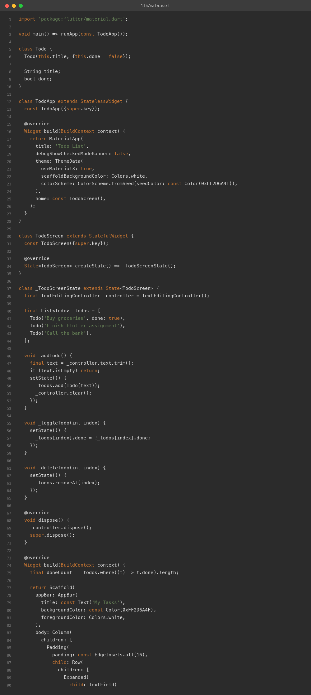
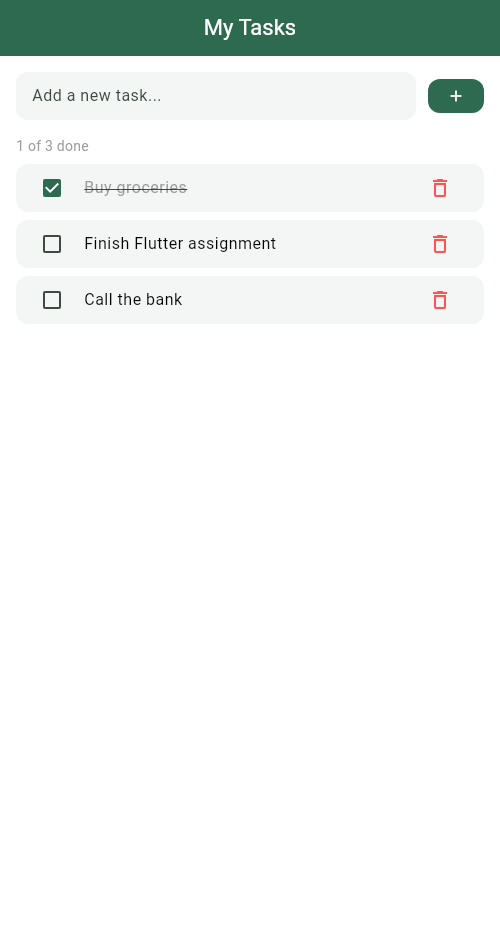
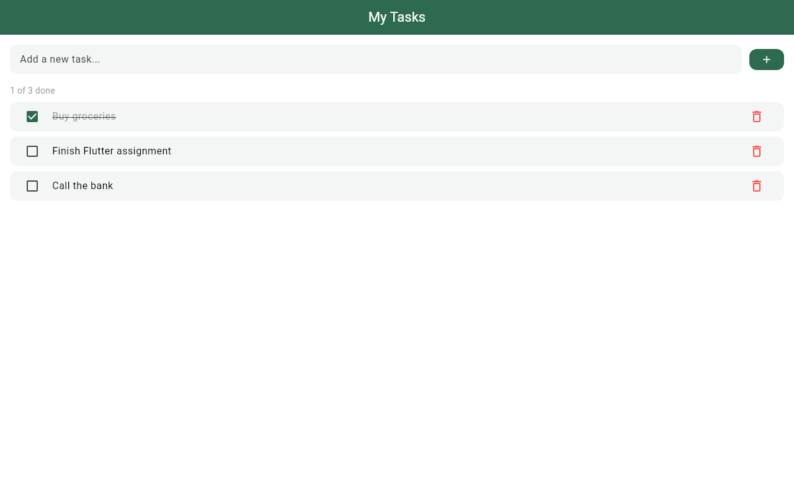
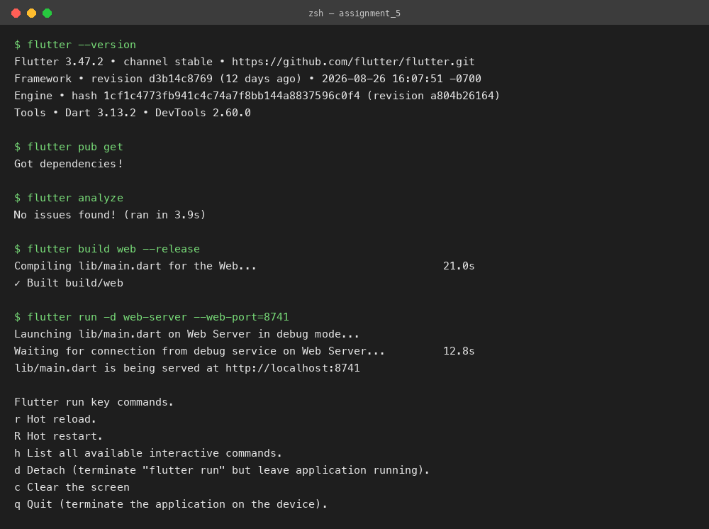

# Todo List App with State

**Assignment 5 — Todo List with StatefulWidget & setState**
**Name:** Soumitra Deshpande
**Roll No:** 150096724035
**Cohort:** Elon Musk
**Environment:** Flutter 3.x / Dart 3.x
**Code:** https://github.com/SoumitraDeshpande11/assignments/tree/assignments_5

---

## 1. Objective

Build a fully functional todo list app in Flutter. The app must use a `StatefulWidget` and `setState` to manage its data, and it must support three operations: adding a task, deleting a task, and marking a task as complete.

---

## 2. Requirements Checklist

| Requirement | Where it lives |
|---|---|
| `StatefulWidget` | `TodoScreen` — its state class is `_TodoScreenState` |
| `setState` | `_addTodo`, `_toggleTodo`, and `_deleteTodo` all wrap their changes in `setState` |
| Add a task | Text field + green `+` button at the top (pressing Enter also works) |
| Delete a task | Red trash icon on each task card |
| Mark complete | Checkbox (or tapping the card) flips the task's `done` flag and strikes the text through |

---

## 3. How the State Works

A stateless widget cannot change anything on screen by itself, so the todo list needs a stateful one. The idea is simple:

1. The task list (`_todos`) is stored inside the `State` class, not in the widget.
2. Every time the user adds, deletes, or checks off a task, the code changes that list **inside a `setState()` call**.
3. `setState` tells Flutter "the data changed, please rebuild the screen". Flutter calls `build` again, and the new list shows up.

Each task is a small `Todo` object with two fields: a `title` (the text) and `done` (true or false).

---

## 4. The Three Operations

- **Add** — `_addTodo()` reads the text field, ignores empty input, puts a new `Todo` at the end of the list, and clears the field so the user can type the next one.
- **Delete** — `_deleteTodo(index)` removes the task at that position with `removeAt`.
- **Mark complete** — `_toggleTodo(index)` flips `done` between true and false. Done tasks get a line through the text and turn grey. The counter above the list ("1 of 3 done") updates on its own because it is counted fresh on every rebuild.

---

## 5. Widget Map

```
MaterialApp
└── Scaffold
    ├── AppBar ('My Tasks')
    └── Column
        ├── Row            ← Expanded(TextField) + FilledButton(+)
        ├── Text           ← "X of Y done" counter
        └── Expanded
            └── ListView.builder
                └── Card per task
                    └── ListTile[ Checkbox, title, delete IconButton ]
```

When the list is empty, the `ListView` is swapped for a friendly "No tasks yet" message.

---

## 6. Source Code



---

## 7. App Screenshots

The app was built for the web (`flutter build web`) and captured in Chrome at two window sizes. The first task is checked off, so the strikethrough, the grey text, and the "1 of 3 done" counter are all visible.

**Phone width (500px):**



**Desktop width (1280px):**



---

## 8. Terminal

Real build-and-run session: `flutter pub get`, `flutter analyze` (no issues), `flutter build web`, then `flutter run -d web-server` to serve the app locally.



---

## 9. Run Instructions

```bash
flutter pub get
flutter run          # pick a device, or use flutter run -d chrome
```

Type a task and press the `+` button (or Enter) to add it, tap the checkbox or the card to mark it done, and tap the trash icon to delete it.

---

## 10. Possible Extensions

- Save the list to device storage with `shared_preferences` so tasks survive a restart.
- Add an edit button to rename an existing task.
- Show a swipe-to-dismiss gesture with `Dismissible` instead of the delete icon.

---

**Built by Soumitra Deshpande · Roll No. 150096724035 · Cohort: Elon Musk**
