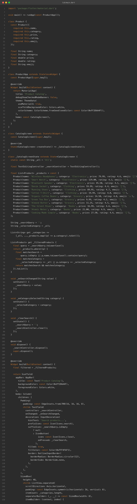
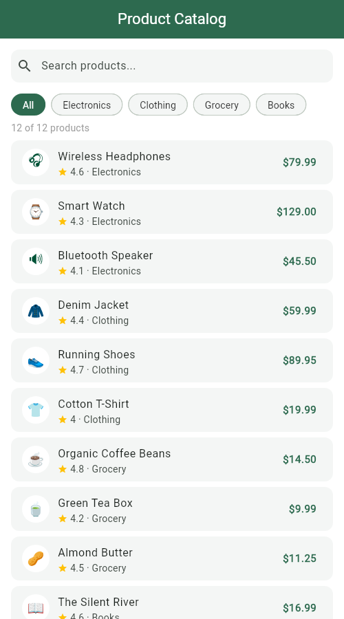
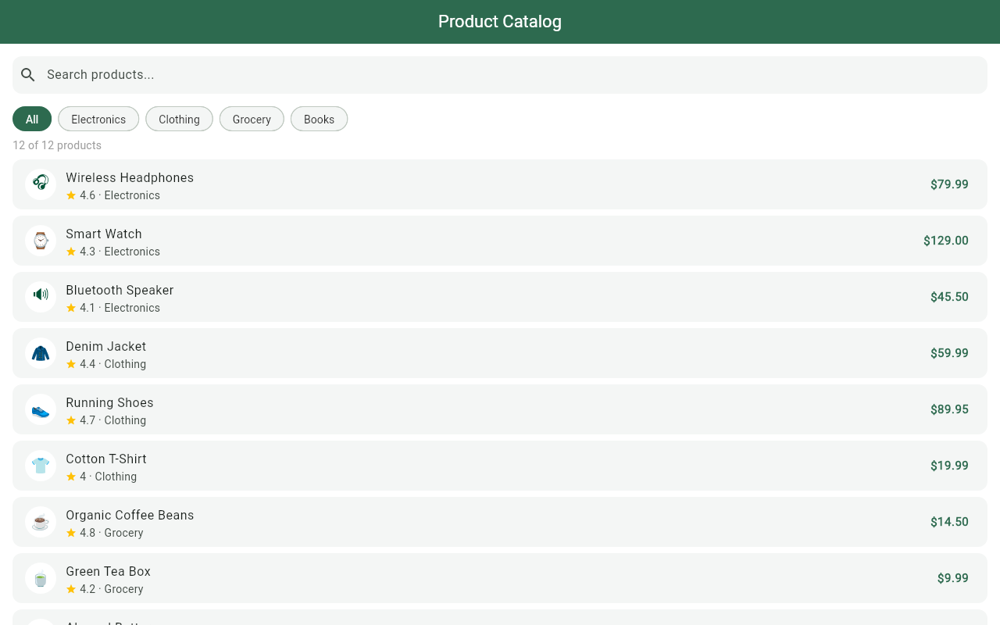
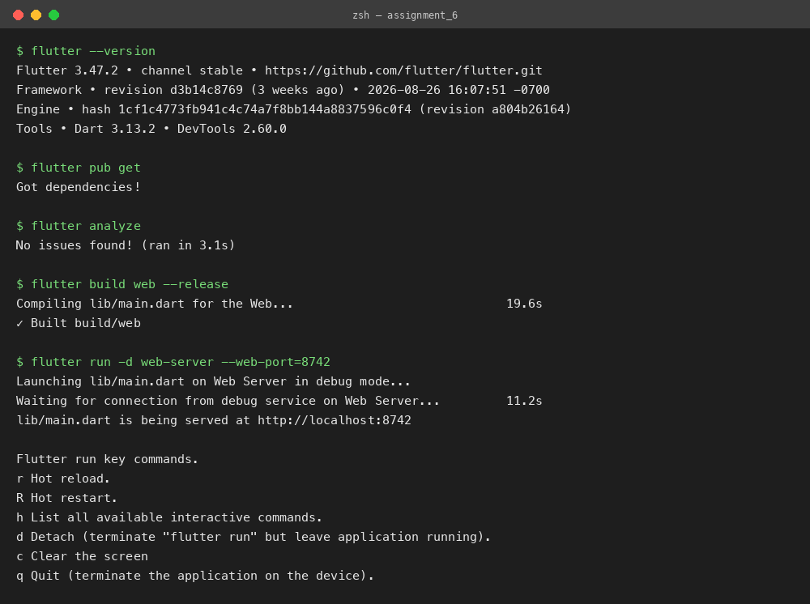

# Product Listing with Search & Filter

**Assignment 6 — Dynamic Product Listing with ListView.builder & setState**
**Name:** Soumitra Deshpande
**Roll No:** 150096724035
**Cohort:** Elon Musk
**Environment:** Flutter 3.x / Dart 3.x
**Code:** https://github.com/SoumitraDeshpande11/assignments/tree/assignments_6

---

## 1. Objective

Build a dynamic product listing app in Flutter. Products must be described by a **data model class**, rendered with an efficient `ListView.builder`, and the user must be able to **search by name** and **filter by category**, with every change applied through `setState`.

---

## 2. Requirements Checklist

| Requirement | Where it lives |
|---|---|
| Data model class | `Product` — an immutable class with `name`, `category`, `price`, `rating`, and `emoji` fields |
| `ListView.builder` | Builds one card per product in the filtered list, lazily, from `itemCount: filtered.length` |
| Search | `TextField` whose `onChanged` stores the query in state via `setState` |
| Filter | A horizontal row of `ChoiceChip`s (All, Electronics, Clothing, Grocery, Books) selected via `setState` |
| `setState` | `_onSearchChanged`, `_onCategorySelected`, and `_clearSearch` all wrap their changes in `setState` |

---

## 3. How the Data Model Works

Each product is a `Product` object:

```dart
class Product {
  const Product({required this.name, required this.category,
      required this.price, required this.rating, required this.emoji});
  final String name;
  final String category;
  final double price;
  final double rating;
  final String emoji;
}
```

The catalog is a hard-coded list of 12 `Product` instances stored in the `State` class. Because the fields are `final`, products never change — only **which** products are shown changes.

---

## 4. How Search & Filter Work

Two pieces of state drive the UI:

- `_searchQuery` — the current text in the search box.
- `_selectedCategory` — the currently selected chip (`'All'` by default).

Both are combined in a getter that recomputes the visible list on every rebuild:

```dart
List<Product> get _filteredProducts {
  final query = _searchQuery.toLowerCase();
  return _products.where((p) {
    final matchesSearch =
        query.isEmpty || p.name.toLowerCase().contains(query);
    final matchesCategory =
        _selectedCategory == 'All' || p.category == _selectedCategory;
    return matchesSearch && matchesCategory;
  }).toList();
}
```

Typing in the search box or tapping a chip calls `setState`, Flutter rebuilds the widget tree, the getter runs again, and `ListView.builder` shows only the matching products. A live counter above the list shows "X of 12 products", and a friendly message appears when nothing matches.

---

## 5. Widget Map

```
MaterialApp
└── Scaffold
    ├── AppBar ('Product Catalog')
    └── Column
        ├── TextField              ← search box (with clear button)
        ├── ListView.separated     ← horizontal row of ChoiceChips
        ├── Text                   ← "X of 12 products" counter
        └── Expanded
            └── ListView.builder
                └── Card per product
                    └── ListTile[ emoji avatar, name, rating · category, price ]
```

---

## 6. Source Code



---

## 7. App Screenshots

The app was built for the web (`flutter build web`) and captured in Chrome at two window sizes.

**Phone width (500px):**



**Desktop width (1280px):**



---

## 8. Terminal

Real build-and-run session: `flutter pub get`, `flutter analyze` (no issues), `flutter build web`, then `flutter run -d web-server` to serve the app locally.



---

## 9. Run Instructions

```bash
flutter pub get
flutter run          # pick a device, or use flutter run -d chrome
```

Type in the search box to narrow products by name, tap a category chip to filter, and tap the `×` in the search box to clear. Both filters combine — searching "tea" with the Grocery chip selected shows only grocery items matching "tea".

---

## 10. Possible Extensions

- Sort the list by price or rating with a dropdown.
- Load products from a JSON file or a real REST API instead of a hard-coded list.
- Add a detail page that opens when a product card is tapped.

---

**Built by Soumitra Deshpande · Roll No. 150096724035 · Cohort: Elon Musk**
