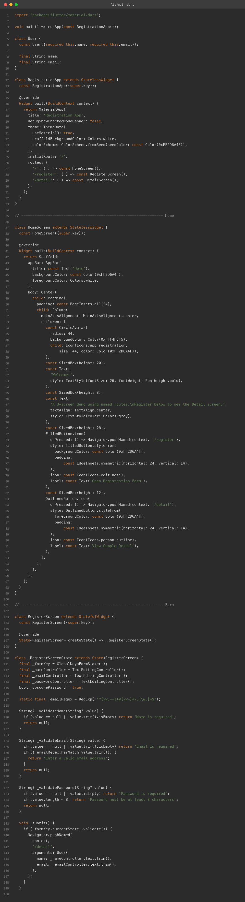
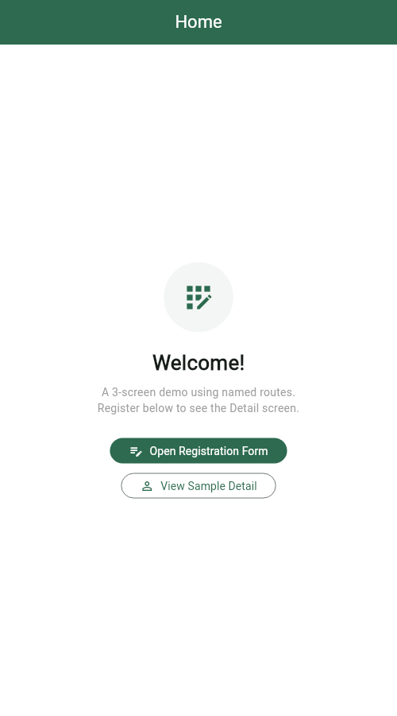
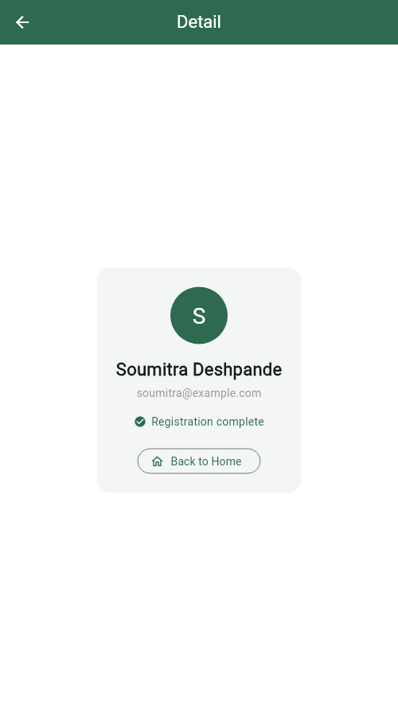
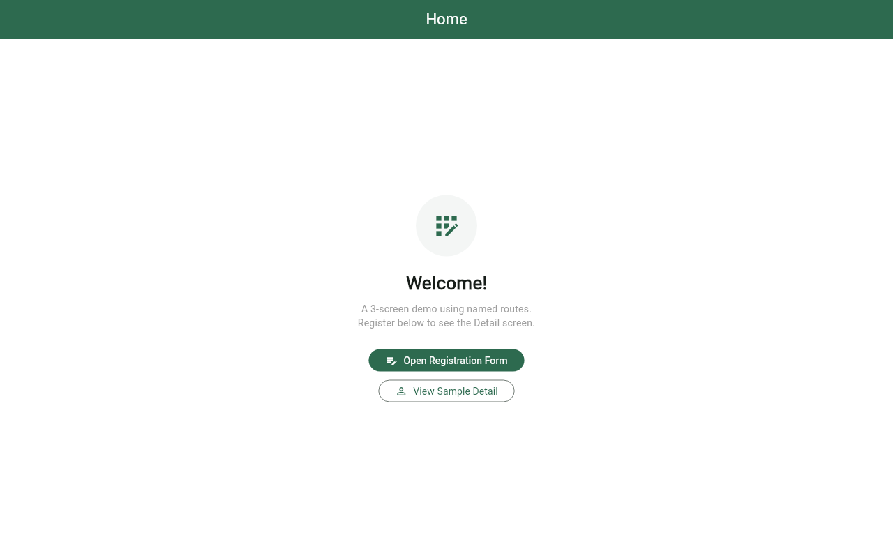
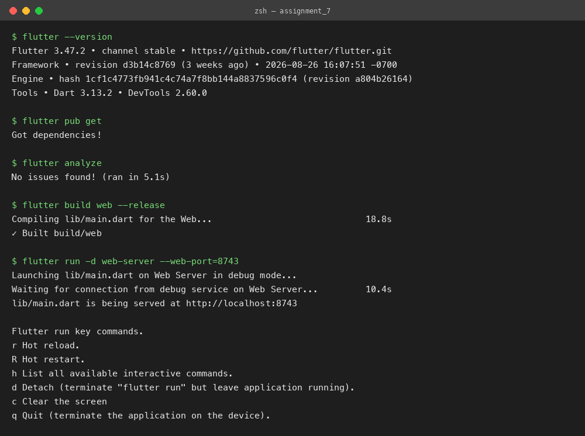

# 3-Screen App with Named Routes & Form Validation

**Assignment 7 — Named Routes (Home, Form, Detail) + Registration Form Validation**
**Name:** Soumitra Deshpande
**Roll No:** 150096724035
**Cohort:** Elon Musk
**Environment:** Flutter 3.x / Dart 3.x
**Code:** https://github.com/SoumitraDeshpande11/assignments/tree/assignments_7

---

## 1. Objective

Build a Flutter app with three screens — **Home**, **Form**, and **Detail** — connected with **named routes**. The Form screen is a registration form with real validation: required fields, an email format check, and a minimum-length password rule. On successful validation, the user's data is passed to the Detail screen as route arguments.

---

## 2. Requirements Checklist

| Requirement | Where it lives |
|---|---|
| 3 screens | `HomeScreen`, `RegisterScreen`, `DetailScreen` |
| Named routes | `MaterialApp(routes: {'/', '/register', '/detail'})` with `initialRoute: '/'` |
| Navigation | `Navigator.pushNamed(context, '/register')` etc. |
| Data model class | `User` — immutable class with `name` and `email` |
| Passing data between screens | `Navigator.pushNamed(..., arguments: User(...))` read back with `ModalRoute.of(context)!.settings.arguments` |
| Required fields | `_validateName`, `_validateEmail`, `_validatePassword` all reject empty input |
| Email validation | Regex `^[\w.+-]+@[\w-]+\.[\w.]+$` checked in `_validateEmail` |
| Password validation | Minimum 8 characters, obscured text with a show/hide toggle |

---

## 3. How Named Routes Work

Instead of building each screen's widget at the call site, the app registers a **route table** in `MaterialApp`:

```dart
MaterialApp(
  initialRoute: '/',
  routes: {
    '/': (_) => const HomeScreen(),
    '/register': (_) => const RegisterScreen(),
    '/detail': (_) => const DetailScreen(),
  },
)
```

Any screen can then navigate by name: `Navigator.pushNamed(context, '/register')`. On the web this also maps each screen to a URL (`/#/register`), so screens are deep-linkable.

To send data forward, `pushNamed` accepts `arguments`. The form passes a `User` object, and the Detail screen pulls it out of the route settings:

```dart
final user = ModalRoute.of(context)!.settings.arguments as User? ?? _sample;
```

If the screen is opened without arguments (deep link or the "View Sample Detail" button), it falls back to a sample user instead of crashing.

---

## 4. How Form Validation Works

The form is a `Form` widget holding a `GlobalKey<FormState>`. Each input is a `TextFormField` with a `validator` function that returns an error string (shown under the field) or `null` (valid):

- **Name** — required (non-empty after trimming).
- **Email** — required, and must match an email regex (`name@domain.tld`).
- **Password** — required, minimum 8 characters, with an eye-icon toggle to show/hide.

Pressing **Register** calls `_formKey.currentState!.validate()`, which runs every validator. Only if **all** pass does the app navigate to `/detail` with the entered data. The password is never sent to the Detail screen — only name and email.

---

## 5. Widget Map

```
MaterialApp (routes table)
├── '/'         → HomeScreen     ← welcome + 2 navigation buttons
├── '/register' → RegisterScreen ← Form[ name, email, password ] + Register button
└── '/detail'   → DetailScreen   ← profile card (avatar initial, name, email)
```

---

## 6. Source Code



---

## 7. App Screenshots

The app was built for the web (`flutter build web`) and captured in Chrome. Each screen was captured at phone width (500px) via its route URL; the Home screen is also shown at desktop width (1280px).

**Home (phone width):**



**Registration form (phone width):**


**Detail screen (phone width):**



**Home (desktop width):**



---

## 8. Terminal

Real build-and-run session: `flutter pub get`, `flutter analyze` (no issues), `flutter build web`, then `flutter run -d web-server` to serve the app locally.



---

## 9. Run Instructions

```bash
flutter pub get
flutter run          # pick a device, or use flutter run -d chrome
```

From Home, tap **Open Registration Form**, fill in name, email, and password, and press **Register**. Try submitting empty fields or a short password to see the inline validation errors. On success, the Detail screen shows the registered user; **Back to Home** pops the whole navigation stack.

---

## 10. Possible Extensions

- Add a confirm-password field that must match the password.
- Replace the routes table with `onGenerateRoute` for typed route arguments.
- Show a loading spinner and a success `SnackBar` before navigating.

---

**Built by Soumitra Deshpande · Roll No. 150096724035 · Cohort: Elon Musk**
