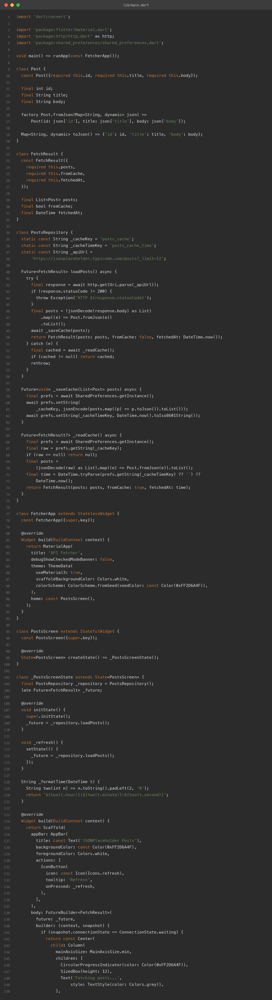
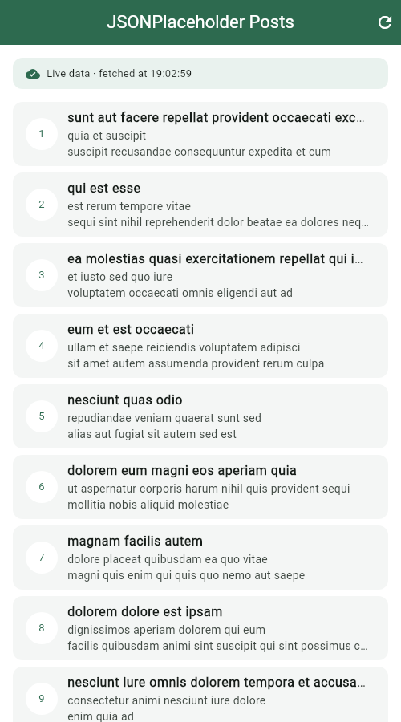
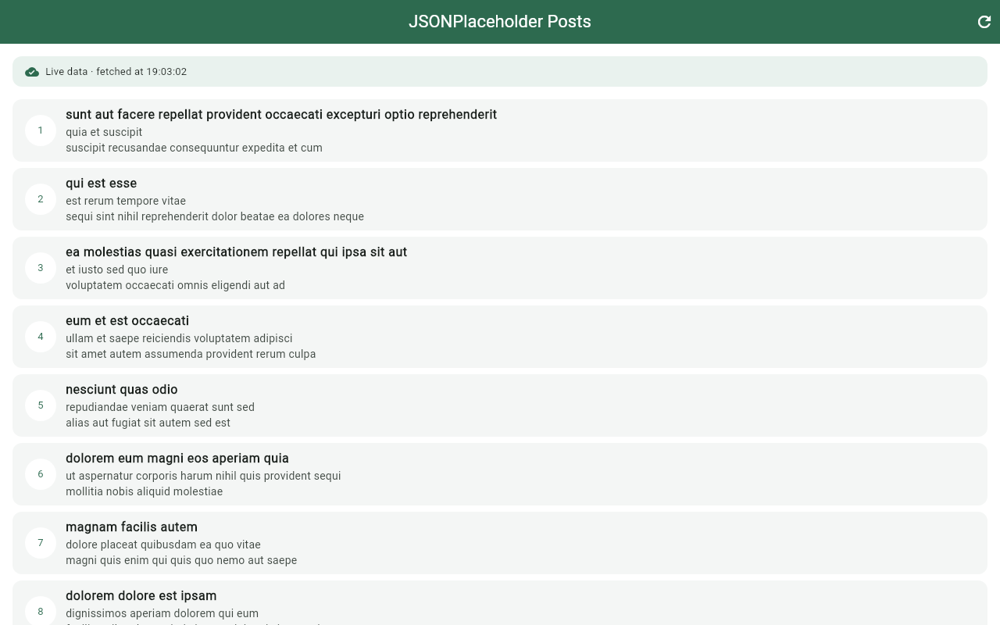
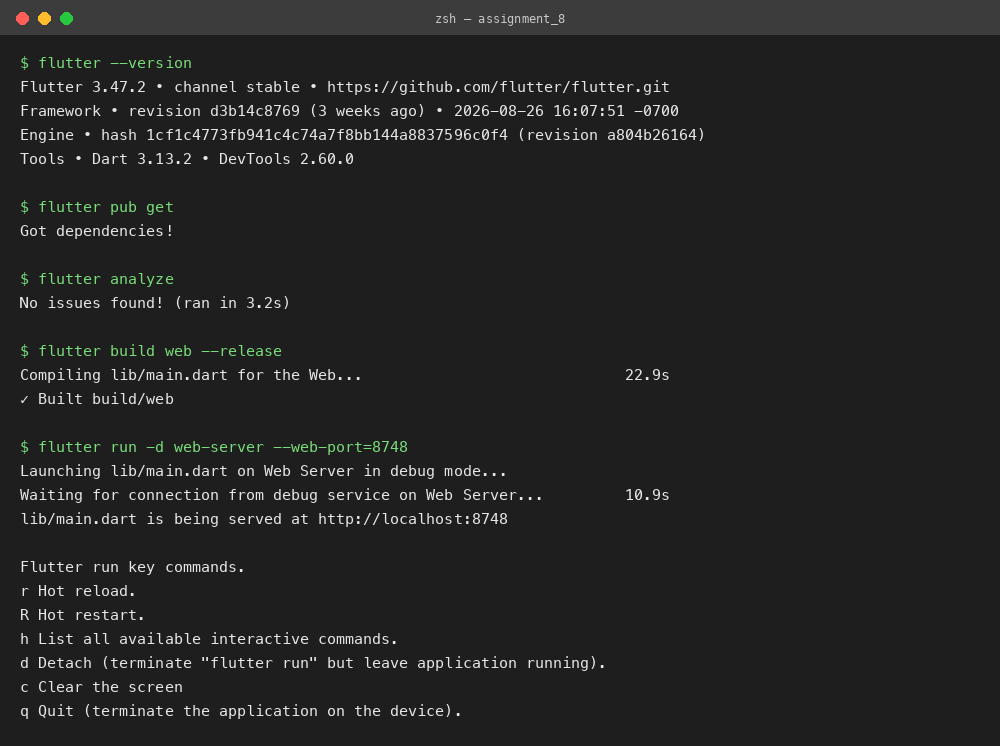

# API Data Fetcher with Local Cache

**Assignment 8 — REST API + FutureBuilder + SharedPreferences Cache**
**Name:** Soumitra Deshpande
**Roll No:** 150096724035
**Cohort:** Elon Musk
**Environment:** Flutter 3.x / Dart 3.x
**Code:** https://github.com/SoumitraDeshpande11/assignments/tree/assignments_8

---

## 1. Objective

Fetch data from a public REST API (JSONPlaceholder), display it with `FutureBuilder`, and cache the last successful result using `SharedPreferences` so the app still shows content when the network is unavailable.

---

## 2. Requirements Checklist

| Requirement | Where it lives |
|---|---|
| Public REST API | `https://jsonplaceholder.typicode.com/posts?_limit=12` via the `http` package |
| `FutureBuilder` | `PostsScreen` builds loading / error / data states from a `Future<FetchResult>` |
| `SharedPreferences` cache | `PostsRepository._saveCache` / `_readCache` store posts + timestamp as JSON |
| Data model class | `Post` with `fromJson` / `toJson` for API parsing and cache serialization |
| Refresh | App-bar refresh icon and a Retry button both re-run the future via `setState` |

---

## 3. How Fetching Works

The `Post` class models one JSONPlaceholder post (`id`, `title`, `body`) with `fromJson`/`toJson` converters. `PostsRepository.loadPosts()` does the work:

1. `http.get` the JSONPlaceholder `/posts` endpoint.
2. On HTTP 200, decode the JSON array into `Post` objects, **save them to the cache**, and return them marked as live data.
3. On any failure — non-200 status, timeout, no network — it **falls back to the cache**: if a previous result was saved, it returns those posts marked `fromCache` with the original fetch time.
4. Only if there is no cache at all does the error reach the UI.

---

## 4. How the Cache Works

`SharedPreferences` stores simple key-value data that survives app restarts (on the web it uses `localStorage`):

```dart
await prefs.setString('posts_cache', jsonEncode(posts.map((p) => p.toJson()).toList()));
await prefs.setString('posts_cache_time', DateTime.now().toIso8601String());
```

Reading reverses it: decode the JSON string back into `Post` objects and parse the saved timestamp. A banner at the top tells the user what they're looking at — **"Live data · fetched at HH:MM:SS"** in green, or **"Offline — cached data from HH:MM:SS"** in amber.

---

## 5. How FutureBuilder Works

`FutureBuilder` takes the future and rebuilds as it moves through states:

- **waiting** → spinner + "Fetching posts..."
- **error** → offline icon, the error message, and a Retry button
- **hasData** → the source banner plus a `ListView.builder` of post cards

The future is created once in `initState`; pressing Refresh or Retry calls `setState` with a brand-new future, which re-runs the fetch.

---

## 6. Widget Map

```
MaterialApp
└── Scaffold
    ├── AppBar ('JSONPlaceholder Posts' + refresh IconButton)
    └── FutureBuilder<FetchResult>
        ├── waiting → CircularProgressIndicator
        ├── error   → offline icon + message + Retry button
        └── data    → Column
            ├── Container        ← live/cached banner with timestamp
            └── Expanded
                └── ListView.builder
                    └── Card per post (id avatar, title, body preview)
```

---

## 7. Source Code



---

## 8. App Screenshots

The app was built for the web (`flutter build web`) and captured in Chrome at two window sizes. Both show a **live fetch from JSONPlaceholder** — the green "Live data · fetched at …" banner is visible above the post list.

**Phone width (500px):**



**Desktop width (1280px):**



---

## 9. Terminal

Real build-and-run session: `flutter pub get`, `flutter analyze` (no issues), `flutter build web`, then `flutter run -d web-server` to serve the app locally.



---

## 10. Run Instructions

```bash
flutter pub get
flutter run          # pick a device, or use flutter run -d chrome
```

The app fetches 12 posts on launch. Tap the refresh icon to fetch again. To see the cache in action, load the app once, go offline (or block the network), and relaunch — the posts reappear from the cache with the amber offline banner.

---

## 11. Possible Extensions

- Add a "stale after N minutes" rule so old cache entries trigger a background refresh.
- Cache images too, using `cached_network_image`.
- Paginate with `/posts?_page=N` and cache each page.

---

**Built by Soumitra Deshpande · Roll No. 150096724035 · Cohort: Elon Musk**
